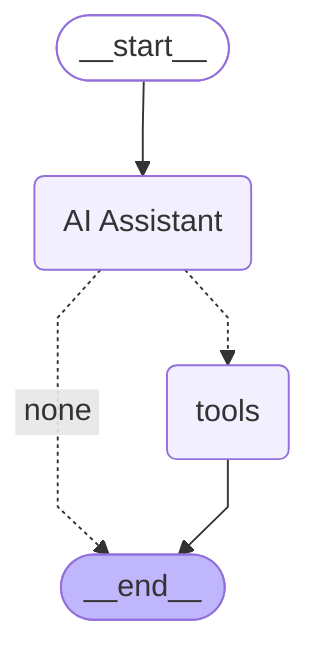

```mermaid
---
config:
  flowchart:
    curve: linear
---
graph TD;
	__start__([<p>__start__</p>]):::first
	AI_Assistant(AI Assistant)
	tools(tools)
	__end__([<p>__end__</p>]):::last
	AI_Assistant -. &nbsp;none&nbsp; .-> __end__;
	AI_Assistant -.-> tools;
	__start__ --> AI_Assistant;
	tools --> __end__;
	classDef default fill:#f2f0ff,line-height:1.2
	classDef first fill-opacity:0
	classDef last fill:#bfb6fc

```